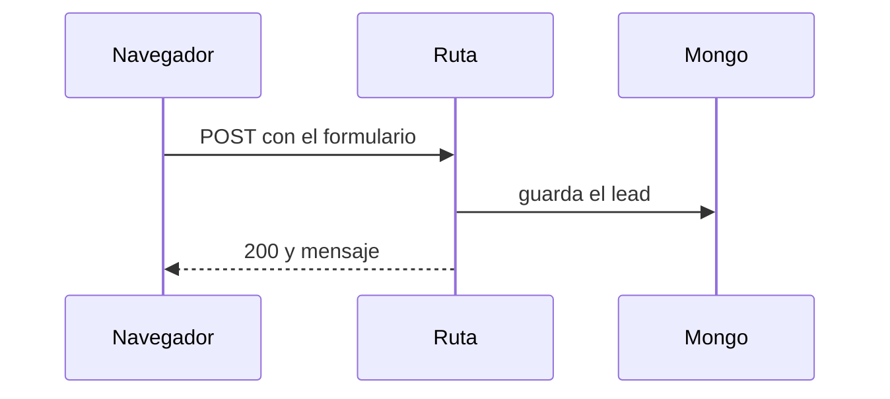

# explicame — la pieza más chica que resuelve la duda

> **Antes de correr `explicame`:** lee el bloque `[CUSTOMIZE]` al final. Define marca, voz
> e idioma. Si vas a usar este skill para otra marca, ese bloque es lo único que cambia.

Una duda, una pieza visual, cero ceremonia. Sin workspace, sin misión, sin archivos de
seguimiento: se dispara, contesta y se va.

El valor no es "hacer diagramas" — es **elegir bien la forma**. Un diagrama de flujo para una
duda de orden es ruido bonito. La forma correcta hace que la duda se disuelva sola.

## El método

Identifica **qué tipo de duda** es. La forma sale de ahí, no del gusto:

| La duda es de… | La pregunta suena a… | La forma |
|---|---|---|
| **ORDEN** | "¿qué llama a qué?", "¿en qué orden corre?" | call tree |
| **CAMBIO** | "¿qué se movió?", "¿qué cambió aquí?" | `diff` |
| **FORMA** | "¿dónde vive esto?", "¿cómo está partido?" | árbol de archivos o de componentes |
| **DECISIÓN** | "¿cuál escojo?", "¿en qué se diferencian?" | tabla comparativa |
| **FLUJO** | "¿cómo viaja el dato?", "¿quién le habla a quién?" | Mermaid (sequence / flowchart) |
| **LÓGICA** | "¿qué decide qué?", "¿cuándo entra este branch?" | pseudocódigo |
| **demasiado densa para texto** | no cabe en un bloque de código | HTML de una pieza (**último recurso**) |

Si la duda no cae claramente en una fila, pregunta cuál es la duda real antes de dibujar.

## Las formas

**Call tree** — orden y anidamiento de llamadas. Solo las que importan para la duda:

```text
POST /api/leads
  withBody(schema)
    checkRateLimit()      ← aquí rebota el spam
  guardarLead()
    addContactToAc()
```

**Diff** — cuando la forma ya existe y el punto es qué cambia. Sirve sobre cualquier
estructura, no solo código: árbol de archivos, call tree, máquina de estados:

```diff
 src/
 ├── commands/
+│   └── explicame.ts
-└── transport.ts
+└── transport/
+    ├── client.ts
+    └── stream.ts
```

**Árbol de archivos o componentes** — dónde vive cada responsabilidad. Poco profundo, con el
porqué de cada rama:

```text
lib/
├── security/     # rate limit y validación — usar estos, no escribir propios
├── content/      # blog, diario, videos
└── data/         # mongodb.ts, única conexión
```

**Tabla comparativa** — dos o más opciones sobre los mismos ejes. Los ejes son lo que hace
útil la tabla: si las columnas no deciden nada, sobran.

**Mermaid** — cuando lo importante es quién le habla a quién y en qué orden:



**Pseudocódigo** — la lógica sin el ruido de la sintaxis real:

```text
al guardar
  si el contenido no cambió
    devuelve lo que ya estaba
  escribe el contenido nuevo
```

**HTML de una pieza** — solo cuando la duda no cabe en texto: una comparación visual, un
layout, una máquina de estados con muchos caminos. Se guarda en `$HTML_DIR`, lleva la marca
de `[CUSTOMIZE]` en el footer, y se abre con `$OPEN_COMMAND`. El texto de la explicación
**nunca** menciona la marca — la marca vive en la pieza, no en la prosa.

## Las dos reglas duras

1. **Una pieza por respuesta.** Si sientes que necesitas dos, la duda son dos dudas: parte,
   contesta la primera y ofrece la segunda. Tres piezas juntas no explican tres veces mejor,
   confunden tres veces más.
2. **HTML es el último recurso, no el primero.** Un call tree en bloque de código se lee sin
   salir del terminal. Un HTML obliga a cambiar de ventana, así que tiene que ganárselo.

## Cuándo NO aplica

Esto resuelve **una** duda de ahora. No es un curso.

Si el tema vale 3+ sesiones, o el usuario dice "quiero aprender X" / "enséñame Y", este skill
no aplica: dilo en una línea y ofrece un skill de estudio dirigido (`$STUDY_SKILL`), que sí
lleva misión, fuentes y registro de lo aprendido. Un explicador que también quiere ser
currículum termina siendo mal explicador y mal currículum.

## Banned patterns

- Varias piezas en una respuesta (rompe la regla 1).
- HTML cuando bastaba un bloque de código.
- Explicar código que podías leer sin haberlo leído. Una explicación bonita de algo que no
  revisaste es una invención con buen formato: lee los archivos, luego dibuja.
- Diagramas con todo lo que existe. Solo lo que la duda necesita — cada caja extra le quita
  fuerza a la que importa.
- Preámbulo antes de la pieza ("claro, con gusto te explico…"). La pieza primero.
- Emojis decorativos, voseo, argentinismos. Si `$VOICE_SKILL` está instalado, corre su VOICE
  GATE antes de entregar; si es `none`, basta con `$LANGUAGE` y esta lista.

---

## [CUSTOMIZE] — Configuración por marca

> Edita SOLO este bloque para usar `explicame` con otra marca. Lo de arriba es el método y
> no se toca.

### Marca
```yaml
BRAND_NAME: "GNB Labs"
BRAND_URL: "gabrielneuman.com"
BRAND_FONT_DISPLAY: "Inter"        # títulos y UI
BRAND_FONT_SERIF: "Lora"           # citas y texto largo
BRAND_COLOR_ACENTO: "#3b5bdb"      # acento principal
BRAND_COLOR_TINTA: "#111827"       # texto de títulos
BRAND_COLOR_CANVAS: "#f7f6f2"      # fondo cálido
BRAND_RADIO: "0.75rem"             # radio de bordes
```

### Voz
```yaml
VOICE_SKILL: "voz-gnb"             # `none` si no tienes un skill de voz — no es requisito
LANGUAGE: "es-MX"                  # sin voseo, sin argentinismos
```

### Cuando el tema es demasiado grande
```yaml
STUDY_SKILL: "aprende"             # a dónde mandar los temas de 3+ sesiones
# `none` si no tienes uno: entonces solo dilo y no intentes la pieza.
```

### Salida
```yaml
HTML_DIR: "./"                     # dónde cae el HTML cuando toca HTML
OPEN_COMMAND: 'Start-Process "<ruta>"'
# PowerShell: Start-Process o ii. NO uses `start "" "<ruta>"` — es cmd.exe y falla.
# macOS: open "<ruta>"   ·   Linux: xdg-open "<ruta>"
```

## Para usar `explicame` con otra marca

1. Copia este `SKILL.md` a `~/.claude/skills/explicame/SKILL.md`.
2. Edita SOLO el bloque `[CUSTOMIZE]`.
3. Si tu marca tiene su propio skill de voz, apunta `VOICE_SKILL` a ese. Si no tienes uno,
   pon `VOICE_SKILL: none` y el skill se salta el VOICE GATE.
4. Pruébalo con una duda real de tu repo antes de repartirlo al equipo.

## Crédito

El catálogo de formas visuales viene de
[humanlayer/skills/show-me](https://github.com/humanlayer/skills/tree/main/plugins/show-me)
(MIT). Lo que agrega esta versión: el método explícito duda→forma (el original lo deja al
juicio del modelo), la regla de una pieza por respuesta, HTML como último recurso, la
frontera con `aprende`, español de México y el bloque `[CUSTOMIZE]`.
