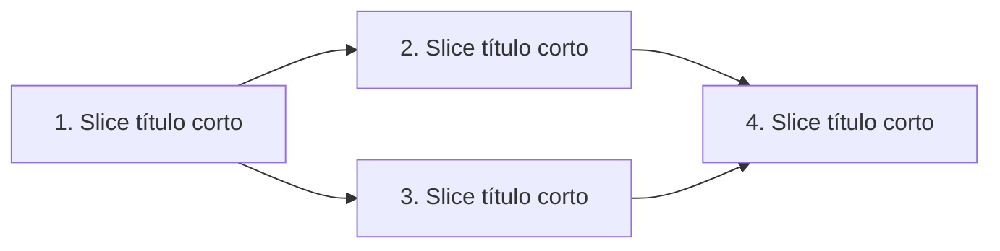

# GNB PRD to Issues

Convierte un PRD en backlog de issues usando vertical slices. El output es **markdown universal** — el comprador lo adapta a su tracker (Linear, Jira, GitHub Projects, Notion, ClickUp, lo que sea).

> **Fuente viva:** el formato de issue de este skill es una copia de `skills/formato-issue/` del repo de GNB. Si cambias la regla allá, re-copia aquí antes del release.

> **Antes de correr este skill:** lee el bloque `[CUSTOMIZE]` al final. Define `$TRACKER_TARGET` y `$LABELS_MAP` para tu agencia. Si vives en Linear hay un modo "publicar directo" — habilitarlo en el bloque.

## Filosofía

1. **El issue lo lee un humano primero.** Título con verbo, TL;DR arriba, "listo cuando" claro, y hasta abajo el contexto y las notas para el agente. Un ticket que solo un modelo entiende es un ticket que nadie toma. Formato exacto en [Formato de issue](#formato-de-issue-orden-obligatorio).
2. **Vertical slices, no horizontal.** Cada issue cruza todas las capas (schema + API + UI + test) en una tajada angosta. Una slice completa es demoeable por sí sola.
3. **Tracer bullets primero.** Empieza por la slice más fina que prueba que el camino end-to-end funciona, aunque sea fea. Las capas se engruesan después.
4. **HITL vs AFK.** Cada slice se marca: HITL (Human-In-The-Loop, requiere humano), AFK (Away-From-Keyboard, agente solo). Prefiere AFK donde se pueda.
5. **Iterar antes de publicar.** El usuario aprueba granularidad ANTES de que el skill cree issues. Nada de "ya cree 47 tickets, ojalá te gusten".
6. **Todo lo creado se puede rastrear.** Cada issue dice cómo nació: label de agente, label de origen y pie con skill + fuente + fecha. Sin eso no se puede distinguir trabajo de agente del de humano, ni levantarle mejoras al skill que lo generó. Ver [Trazabilidad](#trazabilidad-cómo-se-creó-el-issue).
7. **Output portable.** Markdown estructurado con frontmatter — si mañana cambias de Linear a Jira, el backlog se migra con un script simple.

## Proceso

### 1. Reúne contexto

Sin pedir nada todavía:
- Si el usuario pasó un path/URL/ID como argumento, leerlo.
- Si la conversación ya tiene el PRD, usarlo.
- Si hay codebase, leer `CONTEXT.md` / `CLAUDE.md` / `AGENTS.md` para vocabulario y ADRs.
- Si hay `_build_plan/prd.md` o `_build_plan/features/*/prd.md`, leer el más reciente.

### 2. Explora el código (opcional, ligero)

Sin meterte a leer 50 archivos. Solo:
- `tree -L 2` o equivalente para saber qué hay
- Leer 1-2 archivos clave que el PRD menciona
- Identificar componentes/módulos existentes que las slices van a tocar

Objetivo: usar el vocabulario del codebase en los títulos, no inventar nombres nuevos.

### 3. Draftea vertical slices

Rompe el PRD en slices tracer-bullet. Para cada slice:

- **Título:** empieza con verbo en infinitivo, una sola acción, vocabulario del codebase (reglas completas en [Título](#título-verbo-primero-siempre))
- **Tipo:** `HITL` o `AFK`
- **Bloqueado por:** lista de slices que deben terminar antes (puede ser "ninguno")
- **User stories que cubre:** si el PRD las tiene
- **Capas que toca:** schema / API / UI / integración (para validar que ES vertical, no horizontal)

**Reglas duras de vertical slice:**
- Cruza TODAS las capas relevantes para entregar una capacidad end-to-end
- Una slice completa es demoeable o verificable por sí sola
- Prefiere muchas slices delgadas sobre pocas gruesas
- Si una slice toca solo una capa (ej. "crear schema de users"), NO es vertical — fusiónala con la slice que la consume

### 4. Quiz al usuario

Presenta el desglose como lista numerada. Por slice mostrar título + TL;DR de una línea + tipo + bloqueado por + capas.

Preguntar (`AskUserQuestion`):
- ¿La granularidad se siente bien? Muy gruesa / Muy fina / Está bien
- ¿Las dependencias son correctas? Sí / Hay errores (los señalo en chat)
- ¿Alguna slice debe juntarse o partirse más? No / Sí (especifico en chat)
- ¿Las marcas HITL/AFK están bien? Sí / Cambiar las que digo

Iterar hasta que apruebe explícitamente. Sin OK, no se publica nada.

### 5. Publica issues

**Modo por defecto (markdown universal):**

Genera `$OUTPUT_PATH/issues.md` con UN issue por bloque markdown, separados por `---`, con frontmatter YAML. Formato exacto en [Formato de issue](#formato-de-issue-orden-obligatorio).

**Corre el [FORMAT GATE](#format-gate-antes-de-escribir-nada) sobre cada issue antes de escribir el archivo o llamar al MCP.** Un issue que no pasa el gate no se publica: se corrige.

Adicionalmente generar:
- `$OUTPUT_PATH/dependency-graph.md` — visualización de dependencias en Mermaid
- `$OUTPUT_PATH/README.md` — instrucciones de cómo importar a $TRACKER_TARGET

**Modo Linear directo (si `$LINEAR_DIRECT_PUBLISH: true` en `[CUSTOMIZE]`):**

Si el cliente tiene MCP de Linear configurado, además de generar el markdown, publicar via MCP. Publicar en orden de dependencias (bloqueadores primero) para referenciar IDs reales en "Bloqueado por". Pedir confirmación explícita antes de la primera llamada al MCP — no asumir permiso.

**Modo Jira/GitHub/Notion (roadmap, no en V1):**

Por ahora, generar markdown universal y dejar al usuario importarlo. Documentar en `README.md` del output la forma más simple de importar a su tracker.

### 6. Reportar

Máximo 6 líneas:
- N slices creadas
- N marcadas AFK / N marcadas HITL
- N issues corregidos por el FORMAT GATE (y qué falló más)
- Labels de trazabilidad aplicados (y si alguno hubo que crear en el workspace)
- Path del backlog generado
- Si se publicó en tracker: link al primer issue o al cycle
- Próximo paso (1 línea)

## Formato de issue (orden obligatorio)

El orden no es estético: es el orden en que un humano decide si toma el ticket.

```
Título        → ¿de qué se trata?          (2 segundos)
TL;DR         → ¿qué tengo que hacer?      (15 segundos)
Listo cuando  → ¿cuándo termino?           (30 segundos)
Contexto      → ¿por qué y con qué datos?  (solo si ya lo tomó)
```

Nunca al revés. El contexto largo arriba mata el ticket: nadie llega al TL;DR.

### Título: verbo primero, siempre

- **Empieza con verbo en infinitivo.** Crear, Migrar, Corregir, Eliminar, Renombrar, Conectar, Documentar, Medir, Validar, Automatizar, Exponer, Reemplazar.
- **Una sola acción.** Si el título necesita una "y", son dos issues.
- **Objeto concreto:** qué pantalla, endpoint, archivo, cliente o dato. Nada de "el sistema".
- **≤ `$TITLE_MAX_CHARS` caracteres** (default 70) para que no se corte en la lista del tracker.
- Si `$TITLE_TYPE_PREFIX: true`, el prefijo de tipo va antes del verbo: `[Bug] Corregir ...`. Si el tracker ya tiene labels, no lo uses.
- **Nada de gerundios** ("Mejorando el dashboard") ni títulos-sustantivo ("Dashboard de ventas").

| ❌ No | ✅ Sí |
|---|---|
| Project brief | Crear el project brief del proyecto Acme |
| Bug en el login | Corregir el login que rechaza correos con `+` |
| Mejoras al dashboard | Agregar filtro por fecha al dashboard de ventas |
| API de usuarios | Exponer `GET /users` con paginación |
| Revisar y actualizar labels y estados | Renombrar los labels de estado del team PRO *(el "y estados" se va a otro issue)* |

### TL;DR: la primera frase es para el humano

Va inmediatamente después del título. Una frase + 2 a 4 bullets. Se lee de pie, en el celular.

- **Frase 1:** qué hay que hacer y para qué, en español plano. Sin siglas sin expandir, sin "como usuario quiero".
- **Bullets:** acciones concretas, no capas técnicas. El "cómo" detallado va en Contexto.
- Si no cabe en 4 bullets, el issue está gordo → pártelo.
- Se escribe para quien **no** estuvo en la junta ni leyó el PRD.

### Listo cuando: la definición de resuelto

Si no puedes escribir esta sección, el issue no está listo para publicarse — está listo para una pregunta.

- Cada criterio es **observable desde fuera**: se ve, se corre, se mide.
- Redactado como estado final: "El endpoint devuelve 200 con el body X", no "implementar el endpoint".
- Incluye **cómo se verifica** cuando no es obvio: comando, URL, query, pantalla.
- Sin criterios de implementación ("usar React Query") — eso es Contexto.
- Regla de oro: cualquiera debe poder decir sí/no en menos de un minuto, sin preguntarle al autor.

### Contexto: todo lo demás, hasta abajo

Aquí sí puedes ser largo y escribir para el agente: por qué existe, links al PRD y a las user stories, capas que toca, decisiones tomadas, archivos, edge cases, notas de implementación.

## Trazabilidad: cómo se creó el issue

Todo lo que genera el skill —issues, proyectos, hitos— queda marcado. **No es opcional.** Sin marca nadie puede contestar "¿esto lo escribió una persona o un agente?", y el skill que lo generó no se puede mejorar porque no se sabe qué produjo.

**La traza es el label, no una firma en el cuerpo.**

1. **Label de agente** — `$AGENT_LABEL` (default `🤖 creado-por-claude`) en cada issue que el skill cree **o reescriba**. Solo issues: en Linear los proyectos usan otro conjunto de labels (CRM, Portal, E-commerce) y la API no expone la mutación para crear uno nuevo, así que no se marcan.
2. **Label de origen** — `$SOURCE_LABEL` (default `📋 desde-prd`, del grupo `Source`). De qué insumo salió.
3. **Fuente en el cuerpo, como dato del proyecto** — una línea `**Origen:** {path/URL/ID}` dentro de Contexto. Es información útil para quien lea el issue, no una firma.
4. **Frontmatter** — `created_by`, `source`, `created_at`, para auditar por script sin parsear markdown. No se muestra en el tracker.

**Nada de pie de "creado por Claude" en la descripción.** Se probó y se quitó (decisión de Gabriel, 2026-08-29): el label ya dice quién lo hizo, y una firma repetida en cada ticket es ruido que el humano tiene que saltarse cada vez. Consecuencia asumida: sin pie, la traza no distingue "creado" de "reescrito" — el label cubre las dos.

Reglas:

- **La fuente es rastreable, no genérica.** Path del PRD, URL del documento o ID del issue padre. Nunca "una conversación".
- **Usa los nombres reales de los labels del workspace**, no nombres adivinados: verifícalos con `list_issue_labels` del team antes de publicar. Si `$AGENT_LABEL` no existe, créalo o dilo — nunca publiques sin marca.
- **Al actualizar labels de un issue existente, manda los que ya tenía + el nuevo.** El campo `labels` de Linear reemplaza el set completo: si mandas solo uno, borras los demás.
- **Sin backfill por tu cuenta.** Lo creado antes de que existiera esta regla se queda sin marca. Se etiqueta solo cuando el usuario lo pida, o cuando el issue pase por un rewrite.

## Template de issue (markdown universal)

```markdown
---
title: "{Verbo en infinitivo} {objeto concreto}"
type: "AFK" | "HITL"
labels: ["feature" | "bug" | "improvement", "🤖 creado-por-claude", "📋 desde-prd", ...]
created_by: "gnb-prd-to-issues"     # trazabilidad — obligatorio
source: "{path/URL del PRD o ID del issue padre}"  # obligatorio, rastreable
created_at: "{YYYY-MM-DD}"
priority: "high" | "medium" | "low"
blocked_by: ["slice-3", "slice-7"]  # IDs internos del backlog, o "[]" si ninguno
covers_stories: ["US-2.1", "US-2.3"]  # del PRD, opcional
layers: ["schema", "api", "ui", "integration"]  # las que toca
estimate_points: 1 | 2 | 3 | 5 | 8  # opcional, escala Fibonacci
---

## TL;DR

{Una frase: qué hay que hacer y para qué.}

- {Acción concreta 1}
- {Acción concreta 2}
- {Acción concreta 3}

## Listo cuando

- [ ] {Criterio observable, verificable en <1 min}
- [ ] {Criterio observable}
- [ ] {Criterio observable}

## Contexto

{Por qué existe esta slice, qué comportamiento end-to-end entrega, links al PRD/US.
Aquí sí puede ser largo. NO implementación capa por capa en el TL;DR — va aquí.}

**Origen:** {path/URL del PRD o ID del issue padre}
**Padre:** {issue/feature padre, o "(ninguno)"}
**Capas:** {schema / api / ui / integration}

### Bloqueado por

- {slice-N}: {por qué bloquea}

O "Ninguno — puede empezar inmediatamente".

### Notas para el agente (si AFK)

{Archivos a tocar, convenciones del proyecto, edge cases conocidos. Vacío si HITL.}
```

## FORMAT GATE (antes de escribir nada)

Corre esta lista sobre cada issue antes de guardar el markdown o llamar al MCP. Si algo falla, **corrige el issue, no el gate**.

- [ ] El título empieza con verbo en infinitivo.
- [ ] El título tiene UNA acción (sin "y" que una dos trabajos).
- [ ] El título cabe en `$TITLE_MAX_CHARS` caracteres.
- [ ] Hay TL;DR de una frase + 2-4 bullets, antes que cualquier otra sección.
- [ ] El TL;DR se entiende sin haber leído el PRD.
- [ ] Hay sección "Listo cuando" con ≥1 criterio observable.
- [ ] Ningún criterio de "Listo cuando" describe implementación.
- [ ] El contexto y las notas para el agente están hasta abajo, no arriba.
- [ ] Lleva `$AGENT_LABEL` (`🤖 creado-por-claude`) y `$SOURCE_LABEL` (`📋 desde-prd`). En rewrite, `$AGENT_LABEL` va también, sumado a los labels que ya tenía.
- [ ] Los nombres de esos labels se verificaron contra el workspace, no se adivinaron.
- [ ] Contexto trae la línea `**Origen:**` con path, URL o ID — no "una conversación".
- [ ] El frontmatter trae `created_by`, `source` y `created_at`.
- [ ] NO hay pie de "creado por Claude" en la descripción: el label es la traza.
- [ ] Si el skill hereda `voz-gnb`, el texto pasó el VOICE GATE (es-MX, sin relleno).

Reportar en el resumen cuántos issues se corrigieron por el gate. Si no se corrigió ninguno en un backlog de más de 5, sospecha que no lo corriste.

## Modo rewrite — issues en Need Clarification

Se activa con `/prd-to-issues rewrite <ISSUE-ID>`, con "reescribe este ticket" o cuando el usuario pega un issue que nadie entiende. El estado se llama distinto según el tracker (`Clarification needed`, `Need Clarification`, `Necesita info`) — matchear contra `$CLARIFICATION_STATUS` sin distinguir mayúsculas ni orden de palabras. Sirve para el caso más común del tablero: issues creados por plantilla que nacieron bloqueados en `$CLARIFICATION_STATUS` y ahí se quedaron.

### Proceso

1. **Leer el issue completo:** título, descripción, comentarios, estado, labels, proyecto. Los comentarios suelen tener el alcance real.
2. **Separar lo que sí se sabe de lo que falta.** No inventes alcance para llenar huecos: si falta, se pregunta.
3. **Reescribir** con el formato de arriba: título verbo-primero, TL;DR, Listo cuando, Contexto.
4. **Listar las preguntas abiertas** que siguen bloqueando, cada una con quién decide y qué desbloquea. Si son cero, dilo y propón mover a `Todo`.
5. **Conservar el original** bajo "Qué decía antes". Nunca borres información aunque esté mal redactada.
6. **Marcar.** Agregar `$AGENT_LABEL` conservando los labels que ya tenía (en Linear el campo reemplaza el set completo: manda los viejos + el nuevo, o los borras). Sin firma en el cuerpo.
7. **Mostrar antes/después al usuario y pedir OK** antes de escribir en el tracker. Solo se toca título y descripción: no cerrar, no reasignar, no cambiar estado sin permiso explícito.

### Template de rewrite

```markdown
## TL;DR

{Una frase con lo que sí sabemos que hay que hacer.}

- {Acción concreta}
- {Acción concreta}

## Listo cuando

- [ ] {Criterio observable}
- [ ] {Criterio que depende de una respuesta → marcar "(provisional, depende de P1)"}

## Preguntas abiertas (esto es lo que bloquea)

- [ ] **P1.** {Pregunta cerrada, respondible en una línea} — decide: {@quién} — desbloquea: {qué parte}
- [ ] **P2.** {...}

## Contexto

{Lo que se sabe: proyecto, origen, por qué se creó, links.}

### Qué decía antes

> Título original: "{título original}"
>
> {descripción original íntegra}
```

### Preguntas abiertas: ¿lista en el issue o formulario?

Cuando hay preguntas para alguien más, el skill decide entre dejarlas como lista o generar un formulario (skill `/grill-me`). El default es la lista.

**Lista en el issue** cuando se cumple todo: decide el asignado o el usuario que está en la sesión, son ≤ `$FORM_THRESHOLD` preguntas (default 3), y cada una se contesta en una línea. La persona ya está en el issue: un formulario le agrega una vuelta y un lugar más donde buscar.

**Formulario** cuando se cumple cualquiera de estas:

- Decide alguien que **no vive en el tracker** — cliente, proveedor, un área que no entra a Linear.
- Son **más de `$FORM_THRESHOLD` preguntas**: la lista deja de leerse y se vuelve muro.
- Hay **más de un decisor** y cada quien contesta lo suyo.
- La respuesta requiere **buscar datos** (accesos, cifras, documentos), no solo opinar.

**El formulario es propio y las respuestas regresan solas.** Nada de Google Forms ni Tally: un formulario de terceros deja las respuestas en otra herramienta y el issue se queda igual de viejo — que es justo el problema que este skill arregla. El formulario se publica en infraestructura propia y su envío dispara la escritura de vuelta al issue.

Cuatro reglas que lo mantienen honesto:

1. Las preguntas siguen escritas en "Preguntas abiertas". El formulario las espeja, no las esconde.
2. Cada pregunta conserva su ID (`P1`, `P2`…) en el formulario, para mapear respuesta → criterio de "Listo cuando".
3. **El envío escribe en el issue sin que nadie lo pida:** comentario automático con las respuestas. Si esa escritura falla, falla ruidoso — un formulario contestado que nadie ve es peor que no haberlo mandado.
4. Encima del comentario automático va un paso curado que mete las respuestas al cuerpo del issue y convierte cada "no lo sé" en un supuesto declarado. El comentario es el respaldo; el cuerpo es lo que la gente lee.

En GNB esto ya existe: el skill `grill-me-forms` publica el formulario en `crm.gnb.mx/grill/<token>` y el CRM comenta el issue al enviarse (`/grill sync` es el paso curado). Si `$FORM_SKILL` está vacío, no inventes un formulario: deja la lista.

### Reglas del rewrite

- **Una pregunta abierta = una decisión.** Si una pregunta se puede contestar leyendo el repo o el PRD, no es pregunta: contéstala tú y déjala en Contexto.
- **Sin dueño no es pregunta, es queja.** Cada P lleva quién decide.
- Si ya no queda ninguna pregunta, el issue **sale** de `$CLARIFICATION_STATUS` — proponerlo explícitamente en el resumen.
- Si el issue es un clon de plantilla que duplica a otros (mismo título en varios teams), decirlo: la recomendación es fusionar o cerrar, no reescribir cinco veces lo mismo.
- Si el issue está tan vacío que no hay ni TL;DR posible, no lo maquilles: propón cerrarlo y decir por qué.

## Template de dependency-graph.md

```markdown
# Dependency Graph — {Nombre del PRD}



## Camino crítico
{Cadena más larga de dependencias = el mínimo de slices que deben terminar antes del demo.}

## Trabajo paralelizable
{Slices sin dependencias entre sí que pueden ir en paralelo si hay >1 dev.}
```

## Template de README.md (instrucciones de import)

Tres versiones según `$TRACKER_TARGET`:

**Linear (sin MCP):**
> Copia cada bloque entre `---` como issue nuevo. Crea labels base primero: `feature`, `bug`, `improvement`. Asigna prioridad según `priority` del frontmatter. Para bloqueos, usa "Blocked by" en relaciones.

**Jira:**
> Importa `issues.md` como CSV convertido (script de conversión en roadmap). Alternativamente: copia título y descripción manualmente; usa "Issue links → is blocked by" para dependencias.

**GitHub Projects:**
> Crea issues con `gh issue create --title ... --body ... --label ...`. Script de bulk-import incluido en `import-github.sh` si se generó.

**Notion (database):**
> Importa CSV con columnas: Title, Type, Labels, Priority, Blocked By, Status. Crear template "Issue" con propiedades equivalentes primero.

## Reglas

1. **NO publicar sin OK explícito del usuario en Fase 4.** Sin aprobación, no se crea NADA en tracker.
2. **Ningún issue se publica sin pasar el FORMAT GATE.** Título con verbo, TL;DR y "Listo cuando" son obligatorios; el contexto es opcional.
3. **Ningún issue se crea sin marca de origen.** Label de agente + label de origen + línea de Origen en el cuerpo.
4. **NO cerrar ni modificar el issue padre** (PRD, feature parent). El skill solo CREA hijos.
5. **Si el plan no rompe en slices** (ej. cambio atómico de 5 líneas), dilo y crea UN solo issue. No inflar.
6. **En proyecto de cliente:** respeta el formato del tracker existente (auto-branch name, asignación al responsable, plantillas).
7. **Si no hay parentId real**, deja "Padre: (ninguno)" — no inventes referencias.
8. **Tracker agnóstico por default.** Publicación directa solo si `$TRACKER_TARGET = Linear` Y `$LINEAR_DIRECT_PUBLISH: true`.
9. **En modo rewrite no se cambia estado ni asignado.** Solo título y descripción, y con OK del usuario.

## Anti-patrones

- ❌ Slices horizontales ("crear todos los schemas", "crear todos los endpoints", "crear toda la UI"). Inutilizan tracer bullets.
- ❌ Publicar en el tracker sin confirmación del usuario.
- ❌ Slices gigantes ("implementar todo el módulo de pagos") — partir.
- ❌ Slices triviales ("agregar punto al final del título") — fusionar con la slice que las contiene.
- ❌ Inventar dependencias que el PRD no menciona.
- ❌ Títulos-sustantivo ("Dashboard de ventas", "Tema del onboarding") o con gerundio. El humano no sabe qué se le pide.
- ❌ Abrir el issue con tres párrafos de contexto y esconder la acción hasta abajo.
- ❌ Publicar un issue sin "Listo cuando" — sin eso nadie puede cerrarlo y termina en Need Clarification.
- ❌ Escribir el TL;DR con jerga interna o siglas sin expandir porque "el agente ya lo sabe".
- ❌ En rewrite: borrar el texto original o inventar alcance para tapar un hueco. Se pregunta.
- ❌ Publicar sin `🤖 creado-por-claude`: en un mes nadie sabrá si el ticket lo escribió una persona o un agente.
- ❌ Adivinar nombres de labels. Se verifican contra el workspace con `list_issue_labels`.
- ❌ Poner `source: "conversación con Gabriel"`. La fuente se abre y se lee: path, URL o ID.
- ❌ Firmar la descripción con un pie de "creado por Claude". Es ruido en cada ticket; el label ya lo dice.
- ❌ Etiquetar issues viejos por tu cuenta. El backfill se hace cuando el usuario lo pide, no de sorpresa.
- ❌ Mandar solo el label nuevo al actualizar labels en Linear: el campo reemplaza el set completo y borras los que ya tenía.

## Cuándo usar este skill

✅ Después de aprobar un PRD con `gnb-idea-to-prd`
✅ Cuando un cliente manda un spec largo y necesitas backlog accionable
✅ Antes de cotizar un milestone (slices = horas reales, no estimación al ojo)
✅ Para refactorizaciones grandes que necesitan plan secuencial
✅ Cuando el tablero tiene issues en Need Clarification que nadie entiende — modo rewrite

---

## [CUSTOMIZE] — Configuración por agencia/cliente

### Identidad de la agencia
```yaml
AGENCY_NAME: "GNB Labs"
AGENCY_CONTACT: "soy@gabrielneuman.com"
```

### Tracker target
```yaml
TRACKER_TARGET: "Linear"            # Linear, Jira, GitHub, Notion, ClickUp, Trello
LINEAR_DIRECT_PUBLISH: false        # true si el cliente tiene MCP de Linear configurado
LINEAR_WORKSPACE: ""                # solo si LINEAR_DIRECT_PUBLISH = true
LINEAR_TEAM_KEY: ""                 # ej. "DEV", "OPS", "TAREA"
```

### Output paths
```yaml
OUTPUT_PATH: "_build_plan/backlog"  # carpeta donde se generan issues.md + dependency-graph.md + README.md
```

### Labels base (markdown frontmatter)
```yaml
LABELS_MAP:
  feature: "feature"
  bug: "bug"
  improvement: "improvement"
  agent_created: "🤖 creado-por-claude"
  ready_for_agent: "🤖 listo-para-agente"
  ready_for_human: "👤 listo-para-humano"
  needs_triage: "🔍 necesita-triage"
  from_prd: "📋 desde-prd"
```

### Formato de issue
```yaml
TITLE_MAX_CHARS: 70
TITLE_LANGUAGE: "es-MX"             # verbos en infinitivo
TITLE_TYPE_PREFIX: false            # true si tu tracker usa "[Feature] ..." antes del verbo
TLDR_HEADING: "TL;DR"               # "Resumen", "En corto"...
DOD_HEADING: "Listo cuando"         # "Definition of Done", "Se cierra cuando"...
FORM_THRESHOLD: 3                     # más preguntas abiertas que esto → generar formulario
FORM_SKILL: "grill-me-forms"          # skill que arma el formulario; vacío = siempre lista
FORM_HOST: "crm.gnb.mx"               # infraestructura propia; nunca un form de terceros
CLARIFICATION_STATUS: "Clarification needed" # el estado que dispara el modo rewrite;
                                             # matchear sin distinguir orden ni mayúsculas
                                             # ("Need Clarification" es la misma cosa)
```

### Trazabilidad (obligatoria)
```yaml
AGENT_LABEL: "🤖 creado-por-claude"   # label real del workspace, verificar con list_issue_labels
SOURCE_LABEL: "📋 desde-prd"          # grupo Source; el insumo del que salió
TRACE_FOOTER: false                   # pie de "creado por Claude" en la descripción: apagado
TRACE_IN_FRONTMATTER: true            # created_by / source / created_at
BACKFILL: "on-request"                # nunca automático: solo si el usuario lo pide o hay rewrite
```

### Estimación (opcional)
```yaml
USE_ESTIMATES: true
ESTIMATE_SCALE: [1, 2, 3, 5, 8]     # Fibonacci o lineal [1, 2, 3, 4, 5]
```

### Reglas de slicing
```yaml
PREFER_THIN_SLICES: true            # muchas slices delgadas vs pocas gruesas
MAX_SLICE_POINTS: 5                 # umbral para sugerir partir
REQUIRE_VERTICAL: true              # rechazar slices horizontales (solo una capa)
```

### Voz
```yaml
VOICE_SKILL: "voz-gnb"
LANGUAGE: "es-MX"
```

---

## Para forkar este skill

1. Copiar a `~/.claude/skills/<nuevo-nombre>/SKILL.md` o a tu plugin propio.
2. Editar SOLO `[CUSTOMIZE]` con tu tracker y labels.
3. Si vas a publicar directo a Linear, configura MCP y pon `LINEAR_DIRECT_PUBLISH: true`.
4. Probar con un PRD chico antes de usar en proyecto grande.

## Atribución

Filosofía vertical slice / tracer bullets de Andy Hunt & Dave Thomas (*The Pragmatic Programmer*). Patrón `[CUSTOMIZE]` de Anthropic.
